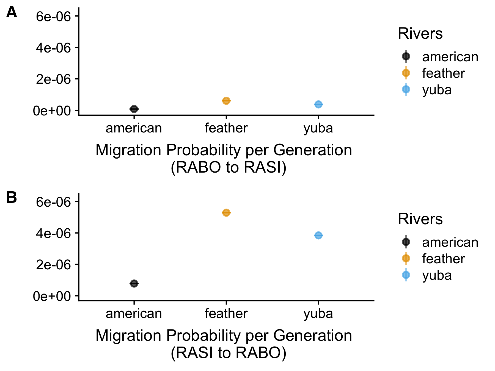

```{r include_packages_ch2, include = FALSE, message=FALSE}

if(!require(devtools))
  install.packages("devtools", repos = "http://cran.rstudio.com")
if(!require(tidyverse))
    install.packages("tidyverse", repos = "http://cran.rstudio.com")
if(!require(ggplot2))
    install.packages("ggplot2", repos = "http://cran.rstudio.com")
if(!require(bookdown))
    install.packages("bookdown", repos = "http://cran.rstudio.com")

suppressPackageStartupMessages({
  library(readr);
  library(knitr);
  library(kableExtra);
  library(tidyverse);
  library(kableExtra)
})

options(knitr.table.format = "latex")

ch2T1 <- read_csv("data/ch2_T1_field-sample-sites.csv")

```


# Hybridization between two sympatric ranid frog species in the northern Sierra Nevada, California {#hybrids}

## Introduction

Landscape changes can influence species demography and migration patterns [@li_ten_2017] which can change rates of gene flow within species. Changing migration rates and population sizes can influence population structure; thus, over time, landscape changes can cause significant changes in genetic diversity within a species. Furthermore, cross-breeding or hybridization between closely related taxa can promote gene flow (introgression) between species, which may be an important evolutionary mechanism for either homogenization (reversing initial divergence between species), speciation (from reproductive isolation of hybrid populations), or adaptation (transfer of adaptive alleles) [@abbott_hybridization_2013; @barrera-guzman_hybrid_2018; @mallet_hybrid_2007].

Hybridization events in vertebrates may be rare, or rarely detected, and thus identifying potential hybridization can be difficult and may be affected by sampling design, timing, and resolution of genetic markers. Therefore, occurrences of hybridization likely remain unknown, particularly in cryptic taxa. Assessing population admixture or detecting potential hybridization has previously been challenging; however, modern genetic methods provide a powerful approach to assess populations at fine geographic and evolutionary scales [@ali_rad_2016; @prince_evolutionary_2017].

We investigate the potential for hybridization in two sympatrically occurring endemic frog species in the Sierra Nevada of California. Foothill yellow-legged frogs, *Rana boylii*, [@baird_descriptions_1856] historically occurred in lower and mid-elevation (<1500 m) streams and rivers from Southern Oregon to northern Baja California west of the Sierra-Cascade crest [@stebbins_field_2003],  whereas Sierra Nevada yellow-legged frogs, *Rana sierrae*, [@camp_notes_1917] typically occurred from 1500 m to over 3600 m in lakes and streams [@stebbins_field_2003; @zweifel_ecology_1955]. Population declines have been documented across the former range of both of these species; *R. sierrae* has been extirpated from over 90 percent of its historical range [@drost_collapse_1996; @vredenburg_reversing_2004] while *R. boylii* has been extirpated from 50 percent of its historical range  [@davidson_spatial_2002; @jennings_amphibian_1994]. Both species are of conservation concern; in 2014, the U. S. Fish and Wildlife Service (USFWS) listed *R. sierrae* as endangered under the U. S. Endangered Species Act (ESA) [@usfws_endangered_2014], and *R. boylii* is listed as a species of special concern in California and is a candidate for listing under the California and federal ESAs.

Unlike other ranid frog species with broad areas of potential intergradation [@shaffer_species_2004], *R. boylii* and *R. sierrae* only rarely occur sympatrically. @zweifel_ecology_1955 described one historical location where these two species co-occurred, in Butte County near DeSabla. Currently the only known location where both species are found is several tributaries to the Feather River in the northern Sierra Nevada, California (Figure \@ref(fig:CH2F1map)). Hybridization between these species has not previously been documented. Furthermore, breeding experiments by @zweifel_ecology_1955 between *R. sierrae* (formerly known as *R. muscosa*) and *R. boylii* yielded very low viability in fertilization and high incidences of embryological abnormalities—indicating a post-zygotic barrier between the species. However, these experiments only crossed female *R. sierrae* with male *R. boylii*, and the individuals were from very different California regions (e.g., Butte and Nevada County vs. Contra Costa County).
*Rana boylii* and *R. sierrae* have very similar morphology and habitat preferences in areas where they co-occur; thus assigning individuals to species is difficult and imprecise using field identification methods. This presents a challenge for management because these sympatric species have different conservation status and management objectives. We employed modern genetic methodology to better understand *R. sierrae* and *R. boylii* where their ranges overlap. We investigated three primary questions:

  1. Can hybridization be detected between two sympatrically occurring threatened and endangered (ESA) frog species in the Sierra Nevada using data generated from genome-wide single nucleotide polymorphisms (SNPs);
  2. If hybrids can be detected, do genetic signatures suggest hybrid viability (i.e., can hybrids reproduce, leading to introgression between species);
  3. Using coalescent modeling, are migration rates between species in sympatrically occurring populations higher than in allopatrically occurring populations in adjacent watersheds?


## Methods

### Sampling and DNA Extraction {#ch2samplecollection}

To investigate potential hybridization between *R. sierrae* and *R. boylii*, a total of 458 tadpole tail clips, buccal swabs, or tissue samples were compiled. Samples were identified to species in the field as either *R. boylii*, *R. sierrae*, or “unknown”, which were individuals which could not be visually confirmed as either species [@stebbins_field_2003]. The samples were collected between 1992 and 2016, from three watersheds in the Sierra Nevada (the Feather, Yuba, and American) (Table \@ref(tab:CH2T1), [Appendix, S5](#supptables)). All unknown individuals were from Feather watershed localities.

The Yuba and American watersheds share a similar Mediterranean climate, underlying geology, watershed aspect (west-slope), and vegetative communities. The Feather watershed shares a similar climate but has a slightly different underlying geology and aspect than that of other watersheds in the Sierra Nevada. The Feather watershed lies in the transition zone of the northern Sierra Nevada and the Cascades/Basin and Range Province, and thus the landscape in the northern portion of the watershed is comprised largely of volcanic bedrock while the southern portion is largely granitic [@durrell_geologic_1988].

\clearpage

```{r CH2T1, results='asis', echo=FALSE, warning=FALSE}

kable(ch2T1, col.names = c("Locality", "River", "No. Samples",
                        "Lat.", "Lon.", "Elev (m)", "Basin (HUC8)"),
      caption = "Sampling localities.", booktabs=T,  longtable = T) %>% 
  kable_styling(latex_options = c("repeat_header"), position = "center", font_size = 9) 
```

\clearpage 

Field sampling was conducted following methods in @heyer_measuring_1994 under CDFW SCP permit #0006881 and federal permit TE-40087B-0 with IACUC protocol #19327 and #04718-001. Individual post-metamorphic frogs were buccal-swabbed following established protocols [@broquet_buccal_2007; @goldberg_frogs_2003; @pidancier_buccal_2003]. Each post-metamorphic individual was comprehensively swabbed underneath tongue and inside of both cheeks for approximately 30 sec to one minute. Swabs were air dried for approximately five minutes and placed in 1.5 mL microcentrifuge tubes while in the field or placed in lysis buffer. Dried samples were stored in the laboratory at -80°C until DNA extraction. Where possible, tail clips from tadpole larvae were collected, and tadpoles greater than 15 mm total length were targeted [@parris_assessing_2010; @wilbur_ecological_1990]. One clip was taken per individual tadpole and dried on Whatman filter paper (grade 1) and stored at room temperature or in 95% ethanol. DNA was extracted from ethanol-stored samples using Qiagen DNeasy kits following manufacturer protocol and stored at -20°C. DNA was extracted from dried buccal swabs and tail clips using an Ampure magnetic bead-based protocol [@ali_rad_2016] and stored at -20°C.

### Rapture Sequencing {#rapture2}

To produce a high-quality genomic resource for frog species with large genome sizes, we interrogated a significant fraction of the *R. boylii* genome using RAD sequencing with SbfI [@ali_rad_2016; @baird_rapid_2008; @miller_rapid_2007]. Paired-end sequence data were generated using 24 *R. boylii* individuals collected previously [@peek_landscape_2010] from coastal and Sierra Nevada populations in California, USA [(Appendix, S2)](#supptables). RAD libraries were constructed following the protocol described in @ali_rad_2016. De novo locus discovery and contig extension were carried out as previously described [@miller_conserved_2012] using the alignment program Novoalign and the genome assembler PRICE [@ruby_price_2013]. This resulted in a set of 77,544 RAD contigs ranging from 300 to 800 bp which served as a de novo partial genome reference for all subsequent downstream analyses [(Appendix, S3)](#supptables). We next removed loci with five or more SNPs, and randomly selected 10,000 loci from the remaining subset. Of these 10,000 loci, 8,533 were successfully designed into 120 bp RAD capture baits by Arbor Biosciences [(Appendix, S4)](#supptables). Sample libraries were prepared for sequencing following RAD Capture (Rapture) methods outlined in @ali_rad_2016. These samples were then used to identify putative high-quality SNPs following sequencing.

Sampled individuals were aligned against the de novo partial genome reference using the BWA-MEM algorithm [@li_fast_2010; @li_aligning_2013], and converted to BAM format and filtered for properly paired alignments using Samtools [@li_sequence_2009]. Next, alignments from three different sequencing runs on an Illumina HiSeq were merged together and duplicates were removed using Samtools [@li_sequence_2009]. For all downstream analysis, we selected individuals that had greater than 25,000 alignments (n=311), which provided sufficient data to investigate population genetic attributes at broad and fine geographic scales [(Appendix, S5)](#supptables).

To generate SNP (i.e., segregating site) data, a probabilistic framework was used for all population genetic analyses as it does not require calling genotypes and is suitable for low-coverage sequencing data [@fumagalli_quantifying_2013; @korneliussen_calculation_2013]. SNP discovery, minor allele frequencies (MAF) estimates, and genotype probabilities were conducted using ANGSD [@korneliussen_angsd_2014]. ANGSD analyses were conducted following methods from @prince_evolutionary_2017, with a minimum mapping quality score (`minMapQ`) of 10, a minimum base quality score (`minQ`) of 20, the genotype likelihood model (`GL 1`), specifying the Rapture bait locations using the `sites` flag, and only sites represented in at least 50% of the included samples (`minInd`) were used. Furthermore, genomic sites were designated as polymorphic only if MAFs were greater than 0.05 and the probability of the site not being polymorphic was less than 1e^-6^. Using this approach, over 44,000 polymorphic sites were identified across all *R. boylii* study samples. 

### PCA and Admixture

To assess population structure and coancestry, ANGSD was used to generate PCA and NGSadmix was used to calculate admixture. Settings used in ANGSD for PCA to identify polymorphic sites included a `SNP_pval` of 1e^-6^, inferring major and minor alleles (`doMajorMinor` 1), estimating genotypic likelihoods (`GL 1`), estimating allele frequencies (`doMaf 2`) [@kim_estimation_2011], retaining SNPs with a minor allele frequency of at least 0.05 (`minMaf`), specifying the Rapture bait locations using the `sites` flag, estimation of genotype posterior probabilities using a uniform prior (`doPost 2`), and the `doIBS 1` and `doCov 1` options. Principal components (PC) summarizing population structure were derived from classic eigenvalue decomposition and were visualized using the ggplot2 package in R [@r_core_team_r_2017]. To assess admixture between *R. sierrae* and *R. boylii*, genotype likelihood data (`GL 1`) was generated in ANGSD with the same settings as above, in addition to retaining only SNPs that were shared in at least of 50% of the samples, `doPost 2`, `doGLF 2`, and limiting to higher quality alignment data (`minMapQ 10`, `minQ 20`). We then used NGSadmix [@skotte_estimating_2013] to infer ancestry proportions in *R. sierrae* and *R. boylii* individuals. NGSadmix is a robust admixture method that can be applied to low-depth NGS data, and does not require called genotypes, thus reducing error associated with potential ascertainment and uncertainty in the data [@skotte_estimating_2013].

### F1 vs. F2 Test with Species Diagnostic SNPs {#f1vsf2}

To test whether hybrids were first generation filial (F1) hybrids or progeny from F1 hybrids from subsequent generations (e.g., F2, F3, etc.), we identified differentially fixed (i.e., species-specific) SNPs and assessed heterozygosity at these loci in hybrid individuals. F1 and F2 hybrid individuals should exihibit different degrees of heterozygosity in species-diagnostic SNPs. We called genotypes in ANGSD using a uniform prior (`doPost 2`) and the following settings: `GL 1`, `doGeno 13`, `postCutoff 0.95`, `doMaf 1`, `doMajorMinor 1`, `minInd 2`, `SNP_pval 1e-6`, `minMapQ 20`, `minQ 20`, and specifying the Rapture bait locations using the `sites` flag. The subsequent output (`*.geno.gz`) was then processed in the program R using the dplyr package [@wickham_dplyr_2018] to manipulate and filter to homozygous diagnostic SNPs. Data were filtered to include only loci where over 50 non-hybrid individuals from each species had called genotypes at a given polymorphism.

### Demographic Modeling with fastsimcoal2

To quantify divergence times and migration rates between *R. sierrae* and *R. boylii*, we used coalescent simulations in fastsimcoal2 [@excoffier_fastsimcoal_2011; @excoffier_robust_2013]. This maximum-likelihood modeling approach uses simulations to estimate the expected site-frequency spectra (SFS) for a demographic model of interest to calculate a composite likelihood, and then utilizes a maximization procedure to find the maximum-likelihood parameter estimates.

We calculated folded joint SFS for each species in each watershed from SNP data generated from ANGSD because the ancestral condition is unknown.  For all models, we assumed the potential for bidirectional gene flow and that extant genetic clusters emerged simultaneously from a common ancestry. We tested models that allowed for population growth, and models with no growth. We used two conservative model scenarios to estimate divergence times and migration rates between species in each watershed. To estimate migration probabilities per generation between species within each watershed, we set the divergence time parameters between 1–1.1 billion years ago to create simplified migration-only models. To estimate divergence time between species, we used the watershed that had the lowest migration rate from the previous migration-only models, and generated divergence time estimates assuming no migration between species.

The basic steps taken to obtain final model estimates from fastsimcoal2 used a set of 25 replicate models, followed by comparison of maximum observed and expected likelihoods to select the best-fit model [@akaike_information_1973], then simulate new SFS using the best-fit model for parametric bootstrapping. Following @excoffier_fastsimcoal_2011, we used 1,000 randomly drawn SNPs from each SFS to generate 100,000 coalescent simulations for likelihood calculations (estimation of the expected SFS) with a maximum of 40 cycles for the conditional maximization algorithm. To select the best-fit model we selected the model replicate that minimized the difference between the maximum expected likelihood and the maximum observed likelihood. We used parametric bootstrapping to generate 95% confidence intervals for each best-fit model using 100 bootstraps for each model and selected the best model from each bootstrap based on maximum likelihoods as described above.

## Results

### Rapture produced high quality genomic data for both *R. sierrae* and *R. boylii*

Individual samples were collected across 56 different sampling localities in three different watersheds (Figure \@ref(fig:CH2F1map), Table \@ref(tab:CH2T1)). For downstream analysis, we filtered and retained 311 samples from the original sequencing data that contained a minimum of 25,000 alignments [(Appendix, S5)](#supptables). The final merged dataset mean alignments per sample was 229,485 [(Appendix, S5)](#supptables), and the mean number of samples per site was eight. These frog species are cryptic, and often occur in low densities, so we retained all sites in our analysis, regardless of the number of samples per locality (Table \@ref(tab:CH2T1)). We conclude that the sequence data we obtained should be appropriate for population genetic analyses across our study area.

(ref:ch2f1map) Map of sampling locations in the Feather, Yuba, and American watersheds. RABO=*R. boylii*, RASI=*R. sierrae*.

```{r CH2F1map, results="asis", warnings=FALSE, messages=FALSE, fig.cap='(ref:ch2f1map)', fig.width = 7.5, echo=FALSE, out.extra="angle=90, scale=.70"}

include_graphics("figure/ch2/figure_01_overview_hybrid.pdf")

```

\clearpage

### PCA shows strong separation between species and identifies putative hybrids

To assess within-basin population structure, principal components analysis (PCA) was used to provide a dimensionless comparison of putative SNPs across species and watersheds (Figure \@ref(fig:CH2F2pca)). Strong differentiation was observed between species (*R. sierrae* and *R. boylii*) on the PC1 axis, which accounted for approximately 55 percent of the variation. PC2 differentiated *R. sierrae* among the three watersheds (Figure \@ref(fig:CH2F2pca)A), while PC3 differentiated *R. boylii* sampling locations among the three watersheds (Figure \@ref(fig:CH2F2pca)B). Little sign of admixture between the two species appears in the PCA, however, two samples—collected in the Feather watershed and designated as "unknown" in the field—clustered halfway between the *R. sierrae* and *R. boylii* groups along PC1, suggesting these individuals were hybrids. 


(ref:ch2f2pca) Principal component analysis of Rapture sequencing data, RABO=*R. boylii*, RASI=*R. sierrae*. A) PC1 vs. PC2; B) PC1 vs. PC3.

```{r CH2F2pca, results="asis", warnings=FALSE, messages=FALSE, fig.cap='(ref:ch2f2pca)', out.width = '95%', fig.align='center', echo=FALSE}

include_graphics("figure/ch2/figure_02_pca_rasi_all_25k_combined.pdf")

```

\clearpage

### Admixture shows two unknown individuals with equal *Rana* species ancestry 

To further investigate if the two unknown individuals identified in the PCA were potential hybrids of *R. sierrae* and *R. boylii*, we used NGSAdmix to assess population structure and individual ancestry from genome-wide SNPs [@skotte_estimating_2013]. We used k=2 to evaluate the fraction of ancestry derived from each species. Admixture showed the same two unknown samples from the Feather basin had approximately 50% ancestry from each species (*R. boylii* and *R. sierrae*), confirming their hybrid ancestry (Figure \@ref(fig:CH2F3admix)). Furthermore, ancestry in the individuals designated as “unknown” in the field also showed very low levels of mixed ancestry between the species. There were very low or nearly non-existent levels of mixed-ancestry in the American and Yuba basins as compared to the Feather. However, introgression between *R. sierrae* and *R. boylii* appears asymmetric, with a greater proportion of ancestry from *R. boylii* occurring in the *R. sierrae* samples, particularly in the Feather watershed, and predominantly in the “unknown” individuals. The putative hybrid individuals were sampled in Bean Creek, a tributary to Spanish Creek ((Figure \@ref(fig:CH2F4hybmap)). Bean Creek was one of the only tributaries where both *R. sierrae* and *R. boylii* co-occur; therefore we conclude there is strong evidence for recent hybridization between *R. sierrae* and *R. boylii* in this drainage.


(ref:ch2f3admix) Admixture (k=2) of *R. sierrae* and *R. boylii* and "Unknown" *Rana* samples from the Feather, American, and Yuba watersheds.

```{r CH2F3admix, results="asis", warnings=FALSE, messages=FALSE, fig.cap='(ref:ch2f3admix)', out.width = '100%', fig.align='center', echo=FALSE}

include_graphics("figure/ch2/figure_03_admix_rana_by_watershed_25k_k2.pdf")

```

(ref:ch2f4hybmap) Map of sample locations in Bean Creek/Spanish Creek in the Feather watershed where hybrids were identified. RABO=*R. boylii*, RASI=*R. sierrae*.

```{r CH2F4hybmap, results="asis", warnings=FALSE, messages=FALSE, fig.cap='(ref:ch2f4hybmap)', fig.width = 7.5, echo=FALSE, out.extra="angle=90, scale=.70", fig.align='center'}

include_graphics("figure/ch2/figure_04_hybrid_bean_ck.pdf")

```

\clearpage

### F1 vs. F2 test on hybrids

To test whether the hybrids were F1 (first-generation) or F2 (progeny of two F1’s), we identified species diagnostic SNPs. Our filtering process (see [Methods](#f1vsf2)) yielded 3,062 putative diagnostic SNPs that were homozygous for different alleles in *R. sierrae* or *R. boylii* samples and also had successfully called genotypes in the two hybrid individuals. F1 hybrids should be exclusively heterozygous at species diagnostic SNPs. In contrast, F2 hybrids should heterozygous for 50% of the species diagnostic SNPs, and homozygous at the remaining 50% with 25% allotted to each species. We observed extremely high heterozygosity and very low homozygosity (6% genotyped as *R. boylii*, 4% *R. sierrae*, and 89% were heterozygous) (Figure \@ref(fig:CH2F5gentest)). This level of heterozygosity is far greater than expected for F2 individuals, and the presence of homozygous genotype calls in the hybrid individuals at species diagnostic SNPs is expected due to low coverage sequencing data; genotyping from low coverage sequencing will cause a low frequency of erroneous homozygous calls, because only one of the two alleles is sampled, causing heterozygotes to be called as homozygotes. We conclude these hybrid individuals are F1 instead of F2 individuals. Furthermore, the hybrid individuals were found to have *R. sierrae* mitochondrial DNA (Bedwell and Goldberg, in review), indicating the female was from a *R. sierrae* individual and the male was from *R. boylii* in both cases.


(ref:ch2f5gentest) The F1 vs. F2 test using species diagnostic SNPs to assess heterozygosity in hybrid individuals. RABO=*R. boylii*, RASI=*R. sierrae*.

```{r CH2F5gentest, results="asis", warnings=FALSE, messages=FALSE, fig.cap='(ref:ch2f5gentest)', out.width = '100%', fig.align='center', echo=FALSE}

include_graphics("figure/ch2/figure_05_f1_f2_hybrid_test_faceted.pdf")

```

\clearpage

### Divergence times and migration rates

To test for differential migration rates between *R. sierrae* and *R. boylii* in the Feather watershed compared to the Yuba and American, we used fastsimcoal2 [@excoffier_fastsimcoal_2011] coalescent simulations. Using all individuals except the two hybrid individuals, we found migration probability (or the per generation likelihood that any gene from one population transfers to another) from *R. sierrae* and *R. boylii* was highest in the Feather, with a mean of 5.29e^-6^ (95% CI 5.28e^-6^–5.30e^-6^) and lowest in the American watershed, 7.80e^-7^ (7.78e^-7^–7.81e^-7^)(Figure \@ref(fig:CH2F6fsc)). The migration probabilities in the Yuba watershed were lower than estimates from the Feather, but were closer in magnitude, 3.84e^-6^ (3.83e^-6^–3.85e^-6^). We found migration rates from *R. boylii* to *R. sierrae* were extremely low across all three (Feather = 6.05e^-7^ [6e^-7^–6.10e^-7^], Yuba = 3.76e^-7^ [3.73e^-7^–3.79e^-7^], American = 8.29e^-8^ [8.23e^-8^–8.35e^-8^]; mean and 95% CI) (Figure \@ref(fig:CH2F6fsc)A). As observed in the admixture analysis, migration rates were asymmetric, showing F1 individuals backcrossing to individuals from *R. boylii* more often than to *R. sierrae*. We conclude migration probability rates are highest in the Feather watershed from *R. sierrae* and *R. boylii*, with very limited migration occurring from *R. boylii* to *R. sierrae*.


(ref:ch2f6fsc) Estimates of migration probabilities from fastsimcoal2 models between the two species within the Feather, Yuba, and American watersheds. RABO=*R. boylii*, RASI=*R. sierrae*, with 95% confidence intervals from 100 bootstrapped estimates.

```{r CH2F6fsc, results="asis", warnings=FALSE, messages=FALSE, fig.cap='(ref:ch2f6fsc)', out.width = '100%', fig.align='center', echo=FALSE}



```


To estimate divergence time between species, we used the American watershed samples because migration estimates between *R. sierrae* and *R. boylii* were lowest, and we wanted to derive a conservative estimate of divergence by minimizing inaccuracy caused by migration. We ran fastsimcoal2 models with no migration and divergence times bounded between 10 kya and 4 mya. The best model based on maximum likelihood estimated the time since divergence between *R. sierrae* and *R. boylii* was 370,856 (95% CI: 370,041–371,670) generations. Typically, *R. boylii* have a generation time of 2–3 years, depending on the region [@kupferberg_pulsed_2009; @railsback_modeling_2015], while *R. sierrae* can have a greater range of generation times, between 3–6 years because tadpoles may overwinter as many as three years [@knapp_developing_2003; @knapp_large-scale_2016]. We may assume the ancestral condition was derived from *R. boylii* [@macey_molecular_2001; @vredenburg_concordant_2007; @yuan_spatiotemporal_2016], therefore we suggest a generation time between two and three years, which means *R. sierrae* likely diverged from *R. boylii* 741 kya to 1.1 mya. This time period corresponds to the early Pleistocene during an era of episodic glaciation (“the Great Ice Age”)—where distributions likely contracted and lineages became isolated—followed by subsequent interglaciation, where distributions expanded [@birkeland_pleistocene_1964; @gillespie_glaciations_2004].

## Discussion

We identified strong divergence between *R. sierrae* and *R. boylii* across all three watersheds, evidence of two F1 hybrids, and low levels of asymmetric introgression primarily in the Feather basin. Hybridization between *R. sierrae* and *R. boylii* has not been previously documented based on field observations and breeding experiments [@zweifel_ecology_1955].

It is unlikely that there is currently the potential for major introgression between *R. sierrae* and *R. boylii*, particularly as hybridization initially may not be adaptive and is often selected against [@abbott_hybridization_2013; @streicher_diversification_2014]. Although hybridization may be common between some amphibian species [@malone_patterns_2008] and can even occur between highly divergent taxa—up to 21 million years divergent [@prager_slow_1975]—our data show there is strong pattern of divergence between *R. sierrae* and *R. boylii* with limited hybridization and introgression between the species. Furthermore, there are currently few localities where *R. sierrae* and *R. boylii* occur sympatrically, and populations of either species are typically sparse in the Sierra [@catenazzi_importance_2013; @kupferberg_effects_2012]. Additionally, these two species may be strongly influenced by elevation due to life history differences (*R. sierrae* are typically found in higher elevations and are capable of overwintering as tadpoles while *R. boylii* are not). Previous work suggests that elevation strongly influences genetic structure in frogs [@monsen_extreme_2004]—further reinforced by the patterns of strong divergence between species within watersheds that we observe in our data. 

There remains the potential for low-levels of naturally occurring hybridization and introgression between *R. sierrae* and *R. boylii*, but currently both species appear to have clear genotypic divergence even in an area of sympatry. Thus, our data suggest this is unlikely to be a major concern for conservation management. While there is a potential for misclassification of individuals in intermediate locations, genetic testing, and/or monitoring could be a useful tool for clarifying species and population boundaries as well as population size estimates.
Successful tests of not only hybridization, but timing of divergence events (as well as better understanding bottlenecks and population expansion) based on landscape history can be informative in understanding what events may have driven divergence. The landscape of the Sierra Nevada during the Pleistocene epoch was one of repeated glaciation [@moore_rangewide_2013]. Rivers flowing into the present-day Central Valley were being alternately eroded by west-flowing streams during interglaciation or covered in glaciers. It is therefore likely that adaptation to colder climates (e.g., freezing lakes and streams) may have provided an advantage to individuals or populations occurring in localities where the effects of glaciation were most prominent. *Rana sierrae* are uniquely adapted to persist in short-growing periods common in the high Sierras—tadpoles may overwinter multiple years before metamorphosing—thus *R. sierrae* may have diverged from *R. boylii* because of their ability to persist in colder climates, common during periods of glaciation during the Pleistocene.

While timing of *R. sierrae* and *R. boylii* divergence in the Sierra Nevada may correspond with the onset of the Pleistocene glaciation, more recent anthropogenic changes may be a stronger driver of current population connectivity and structure. With increased global temperatures and more variable winter periods in the Sierra Nevada, long-term persistence of high elevation species such as *R. sierrae* may reside in the ability for the species to adapt to significant change. Future hybridization events could provide paths for introgression of selectively favored alleles between *R. sierrae* and *R. boylii*, and our data show this could be possible, given the presence of gene flow between species; even very limited introgression could provide adaptive alleles for subsequent positive selection.

In rare species with small population sizes, hybridization outcomes that fail to produce successful offspring (sterile F1 hybrids) may have a greater cost on the species with low numbers of effective breeders, affecting both locally adapted populations and negatively impacting the probability of population persistence in a given region [@pagano_frog_2003]. For *R. sierrae*, current patterns of hybridization do not appear likely to affect population persistence; however under future scenarios (e.g., warming climate, range contraction, population crashes) the loss of even several breeding individuals (via reproduction with *R. boylii*) may have a significant impact in declining populations. Given the pattern of asymmetric admixture and migration observed in the Feather watershed, it is likely there are more *R. boylii* present in the region the hybrids were observed than *R. sierrae*. This difference could potentially lead to greater competition for *R. sierrae* females and reducing male *R. sierrae* reproductive success through the loss of mating opportunities. This may lead to a reduction in the fitness of *R. sierrae* females because the female deposits one egg clutch per year.

## Conclusion

Assessing the impacts of current landscape and watershed change on the genetic variation of organisms, particularly sensitive and endangered species, may be a crucial tool for monitoring and more robust restoration, translocation, and conservation efforts. Future conservation of these species will require several key components, including establishing higher resolution population boundaries across the species' ranges, particularly in the northern Sierra Nevada, delineation of distinct population segments that can be utilized in conservation management, and quantification of relative genomic health of these groups. Identification of hybridization is a key step towards better delineating management units and further understanding what conservation steps may be taken.


### Acknowledgements

Many thanks to all who helped collect/provide/prepare samples: Corey Luna, Rick Wachs, and Sarah Mussulman. Thanks to Cathy Brown, Colin Dillingham, and all the USFS field crew members who helped collect these samples. 
